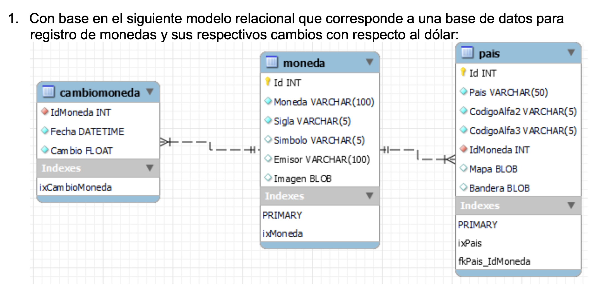
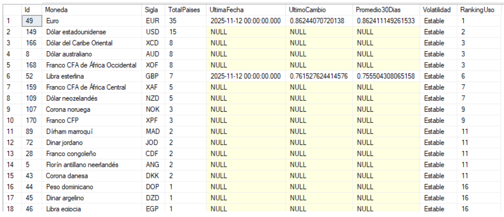

# SQL-UsingCTE

## Listar todas las monedas, junto con:
- Cantidad de países que usan cada moneda
- Fecha del último cambio registrado
- El valor del último cambio
- El promedio de cambio en los últimos 30 días
- Clasificación de volatilidad
- Ranking por cantidad de países que usan la moneda.

### **Usando WITH y subconsultas**

